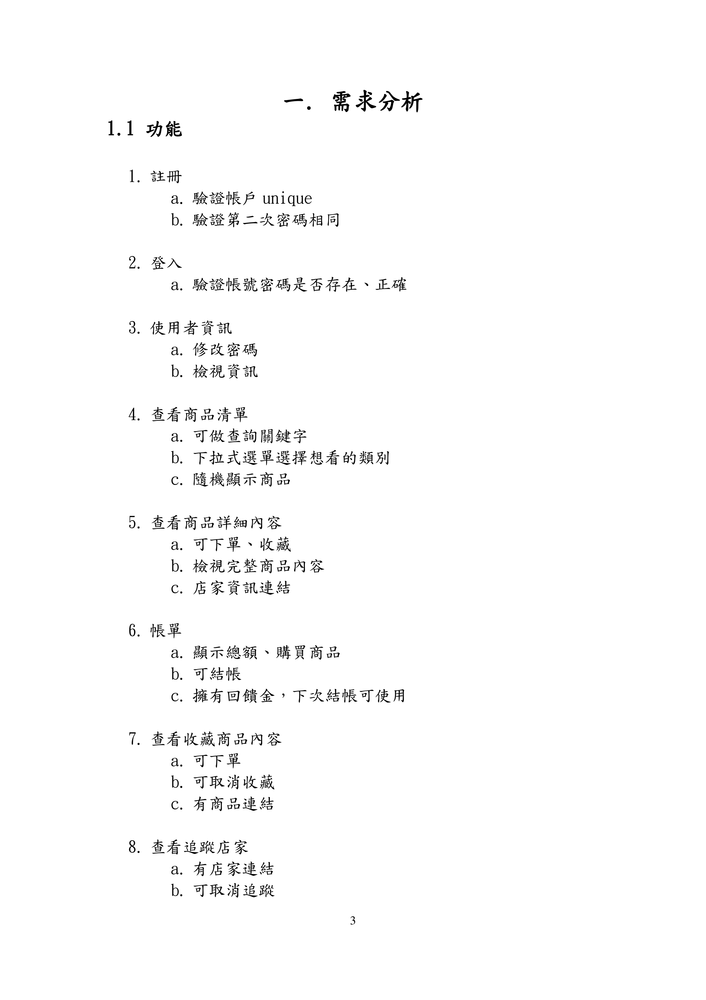
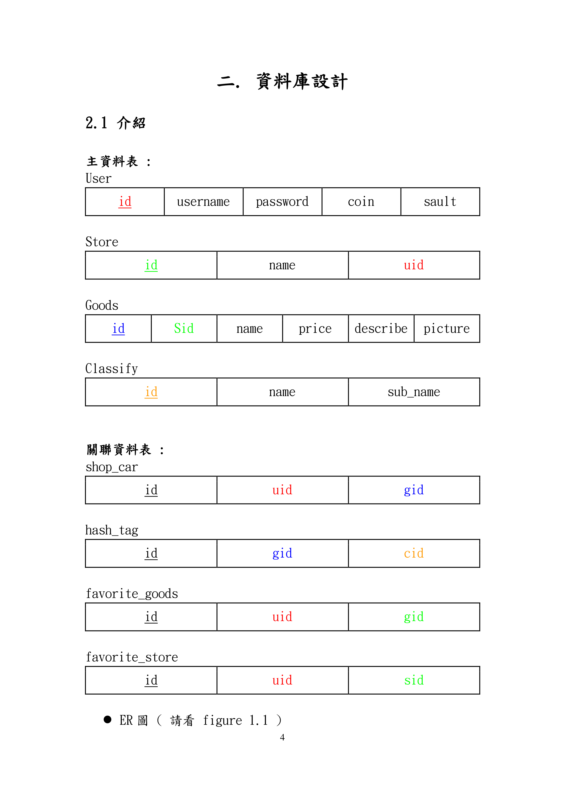
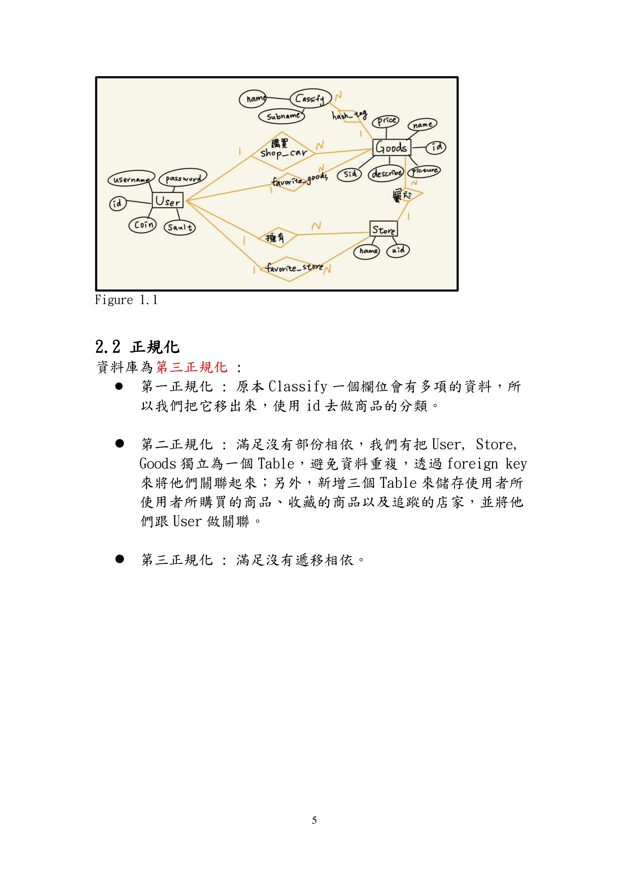
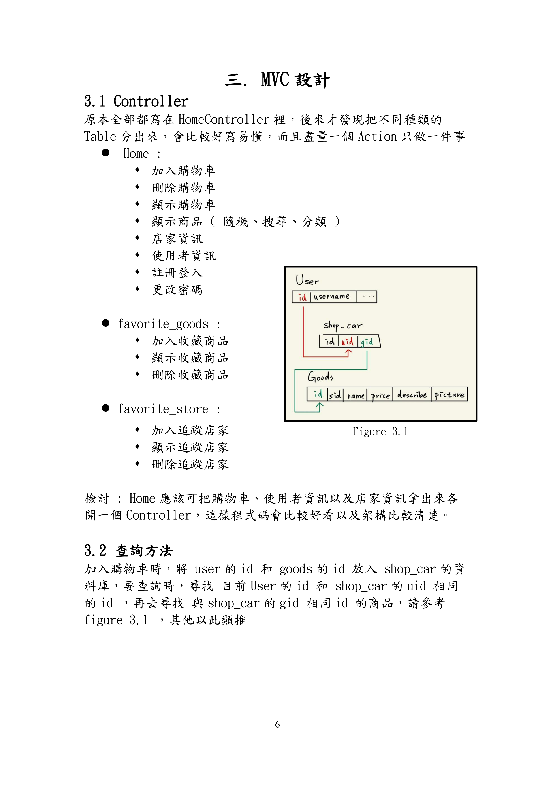
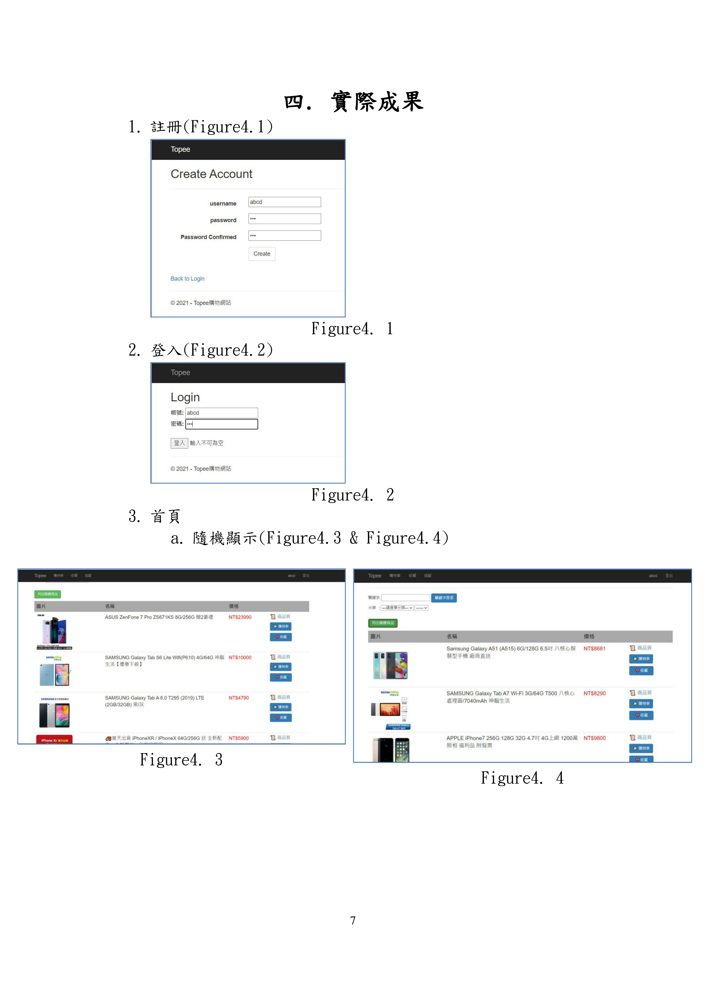
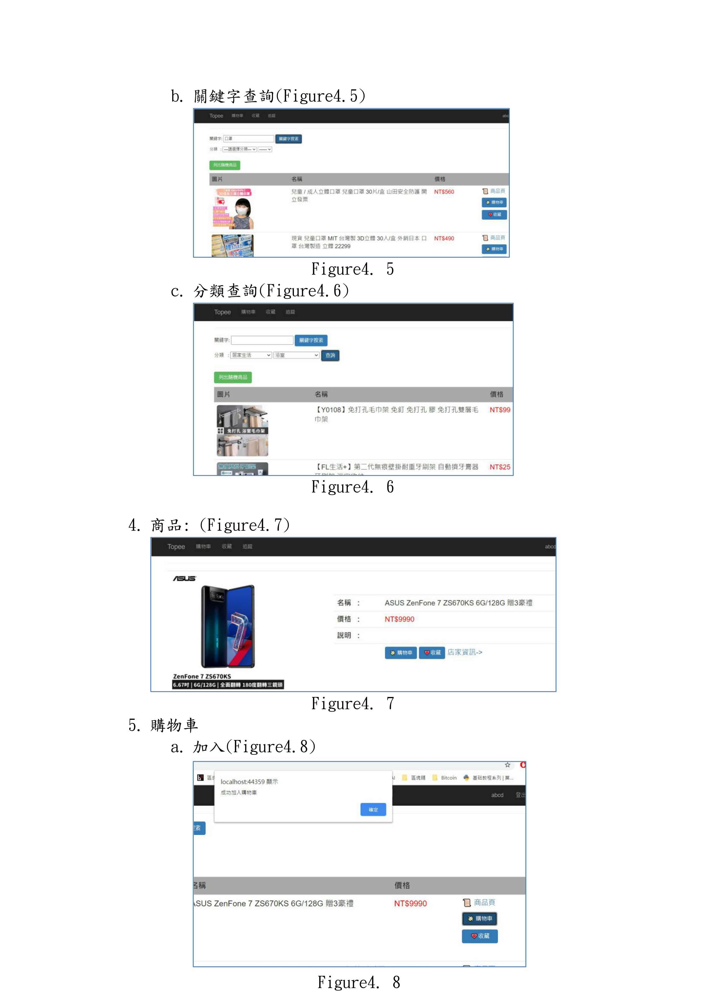
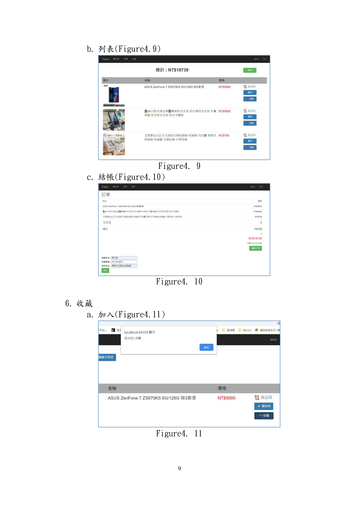
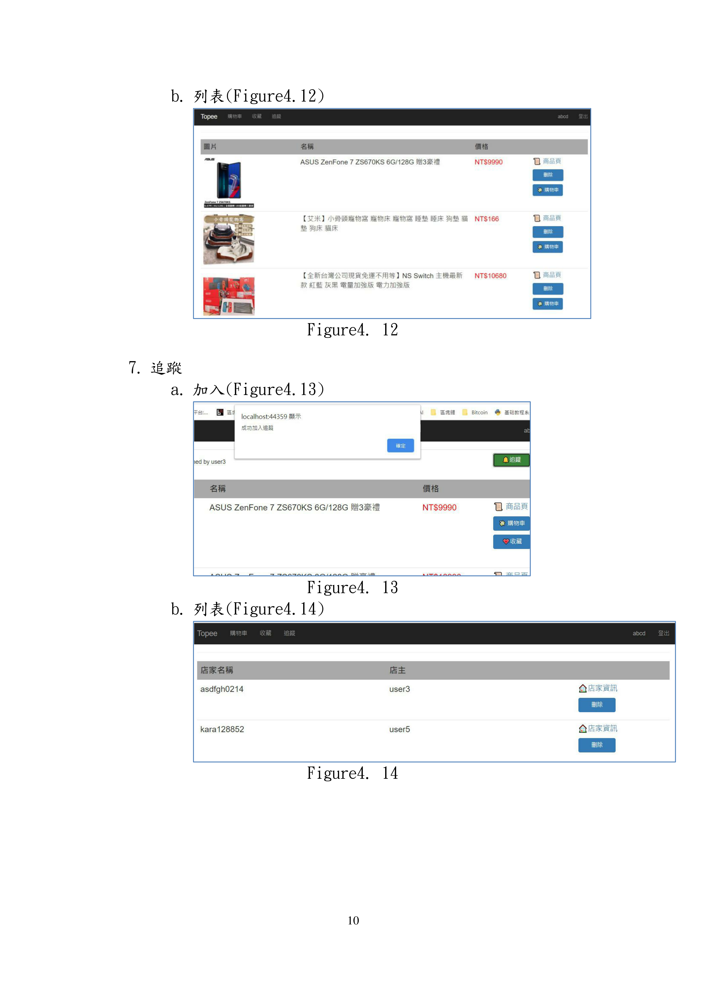
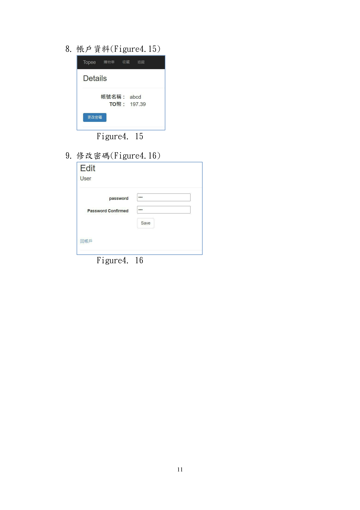
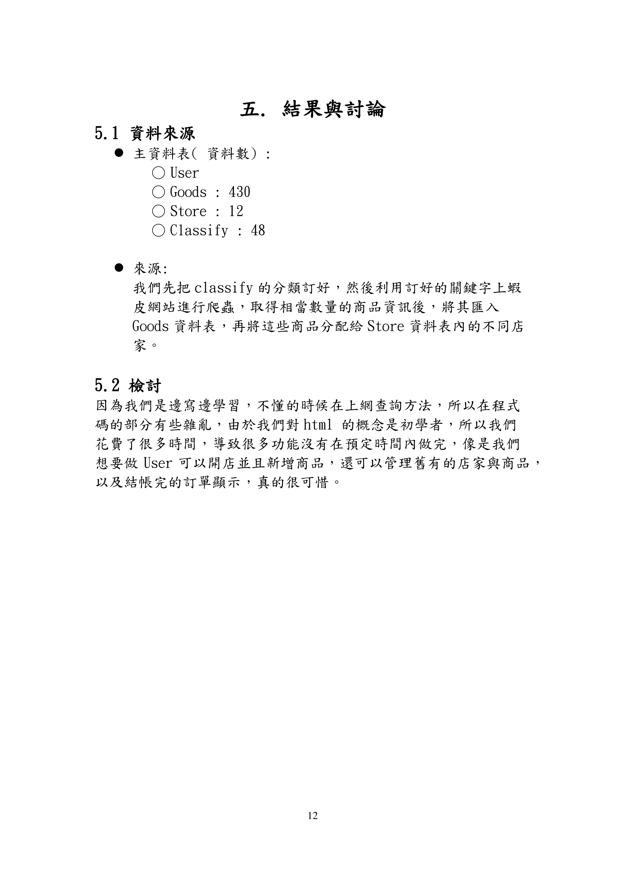

# TopeeMall
### 資料庫程式設計 小組期末專題
日期 : 2021/01/05

組員 : 1072911 陳元娣、1072928 江毓晴

#### References（參考文獻） 
1. Input 屬性: https://matthung0807.blogspot.com/
2. HTML.PasswordFor : https://bbs.csdn.net/
3. 更新資料表: http://vmiv.blogspot.com/
4. HTML.Actionlink : https://blog.csdn.net/linybo/article/details/44238543
5. Input required 屬性 : https://www.w3school.com.cn/html5/att_input_required.asp
6. Url 傳遞參數 : https://www.itdaan.com/blog/2012/10/22/9cc4aa2aceb6668ba01d61cbeae5dc36.html
7. C#亂數 : https://stackoverflow.com/questions/3975290/produce-arandom-number-in-a-range-using-c-sharp
8. Ajax 傳遞多個參數 : https://blog.csdn.net/dongli5012/article/details/81235817
9. 下拉式選單 : https://kevintsengtw.blogspot.com/2012/07/aspnetmvc-3.html
10. Auto increment : https://dotblogs.com.tw/IanChiu28/2017/05/21/142523
11. Input & button : https://dotblogs.com.tw/IanChiu28/2017/05/21/142523
12. 學長 : BooksShoppping
